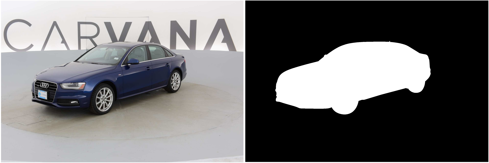
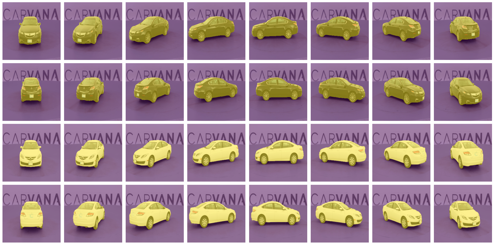

# **🧠 Construcción y Entrenamiento de una Red U-Net desde Cero**

## 📌 **Descripción del Proyecto**
Este proyecto tiene como objetivo construir y entrenar una red neuronal **U-Net** desde cero, basada en la arquitectura descrita en el paper original *U-Net: Convolutional Networks for Biomedical Image Segmentation* de Ronneberger et al. (2015). Para el entrenamiento, utilizamos el conjunto de datos del **Carvana Image Masking Challenge** en Kaggle, que proporciona imágenes de automóviles y sus respectivas máscaras segmentadas.

## 🔬 **Motivación y Contexto**
U-Net es una arquitectura de red neuronal convolucional diseñada originalmente para la segmentación de imágenes biomédicas. Sin embargo, su capacidad para generar segmentaciones precisas con pocos datos la ha convertido en una herramienta clave en diversas aplicaciones de visión por computadora.

### **¿Por qué construir U-Net desde cero?**
- Comprender en profundidad la arquitectura U-Net y su funcionamiento interno.
- Adaptar la red para distintos tipos de segmentación de imágenes.
- Experimentar con diferentes configuraciones y optimizaciones en el entrenamiento.

## 🏗️ **Construcción de la U-Net**
La red se ha implementado siguiendo la arquitectura descrita en el paper original. Su estructura en forma de "U" consta de dos componentes principales:


1. **Contracción (Encoder):**
   - Aplicación de capas convolucionales para extraer características.
   - Uso de *max pooling* para reducir dimensiones y aumentar la profundidad.

2. **Expansión (Decoder):**
   - Uso de *transposed convolutions* para aumentar la resolución.
   - Concatenación con capas correspondientes del encoder para conservar detalles.
   - Generación de una máscara segmentada del mismo tamaño que la imagen de entrada.

## 🏋️ **Entrenamiento**
### **Datos Utilizados**
- **Carvana Image Masking Challenge** en Kaggle [(Enlace al dataset)](https://www.kaggle.com/c/carvana-image-masking-challenge)

- Utilizaremos los datos de entrenamiento, validación y test.


## 🏋️ **Evaluación**


## 🚀 **Requisitos e Instalación**
### **1. Clonar el repositorio**
```bash
git clone https://github.com/tu-usuario/unet-segmentation-carvana.git
cd unet-segmentation-carvama
```

### **2. Instalar dependencias**
```bash
pip install -r requirements.txt
```

### **3. Ejecutar el Jupyter Notebook**
```bash
U-NET.ipynb
```

## 🤝 **Contribuciones**
Las contribuciones son bienvenidas. Para colaborar:
1. Hacer un *fork* del repositorio.
2. Crear una nueva rama con una mejora o corrección.
3. Enviar un *pull request* para revisión.


---

📄 **Referencia:**
Ronneberger, O., Fischer, P., & Brox, T. (2015). [U-Net: Convolutional Networks for Biomedical Image Segmentation](https://arxiv.org/pdf/1505.04597)
